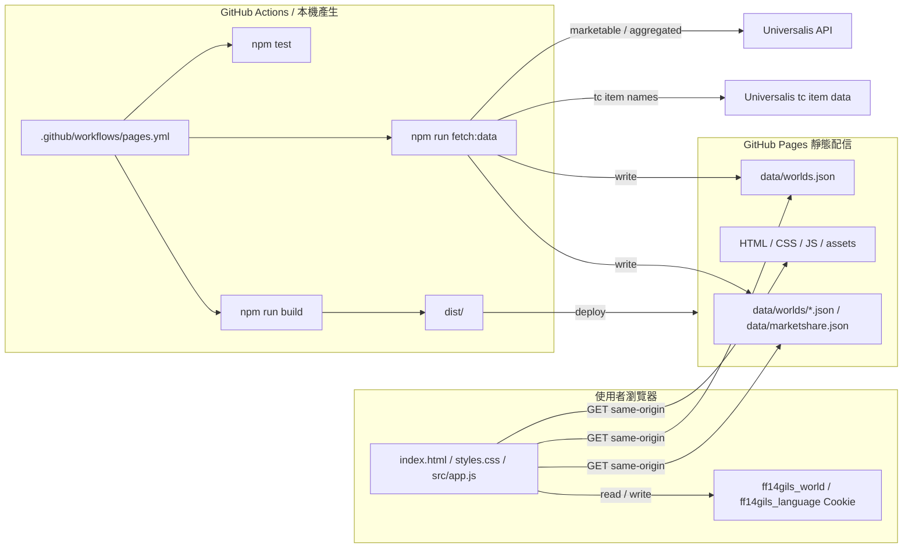

# FF14Gils 繁體中文伺服器版

FF14Gils 是用 GitHub Pages 部署的靜態市場看板，用來從 FINAL FANTASY XIV 繁體中文伺服器市場資料中找出比較容易販售的金策候選。這個 fork 聚焦 Universalis 已支援的 `繁中服 / 陸行鳥` 資料中心，預設世界為 `伊弗利特`。

## 版本範圍

- UI 預設語言為繁體中文，並保留日本語、English 切換。
- GitHub Actions 預設產生 `陸行鳥` DC 的 `伊弗利特`、`迦樓羅`、`利維坦`、`鳳凰`、`奧汀`、`巴哈姆特`、`拉姆`、`泰坦` 市場快照。
- 初始顯示世界為 `伊弗利特`，銷售期間支援 1 天、3 天、7 天。
- 使用者瀏覽器只讀取 GitHub Pages 上的靜態檔與預先產生 JSON，不會直接呼叫外部市場 API。
- 道具名稱使用 Universalis 前端的 `tc` 道具資料包，市場統計使用 Universalis API。

## 資料與權利

FF14Gils 是 FINAL FANTASY XIV 的非官方粉絲網站，與 SQUARE ENIX CO., LTD. 無關。FINAL FANTASY XIV 相關名稱、資料、圖片與其他權利均屬 SQUARE ENIX CO., LTD. 所有。

資料生成使用下列公開資料來源：

- Universalis API：取得繁中服世界、市場可交易 item IDs、aggregated market board data。
- Universalis 前端道具資料：取得 `tc` 繁體中文道具名稱。

外部資料來源的規格與使用條件可能變更，正式公開前請確認各資料來源條款。上游 repo 未附明確開源授權檔，若要長期公開維護 derivative version，建議先向原作者確認授權。

## 架構



## 開發指令

```powershell
npm test
npm run fetch:data
npm run build
npm run serve
```

## 環境變數

`npm run fetch:data` 可用下列環境變數調整資料產生範圍：

- `FF14GILS_SERVER`：初始顯示世界，繁中服版預設 `伊弗利特`。
- `FF14GILS_WORLDS`：要產生的世界清單，使用逗號分隔。未指定時會產生 8 個繁中服世界。
- `FF14GILS_PERIODS`：要產生的銷售期間，可用 `1d`、`3d`、`7d`。
- `FF14GILS_ITEM_NAME_LANGUAGE`：道具資料語系，繁中服版預設 `tc`，也接受 `zh-TW`。
- `FF14GILS_ITEM_LIMIT`：每個世界查詢的可交易 item ID 數量，預設 300。
- `FF14GILS_MAX_ITEMS`：每個快照保留的推薦 item 數量，預設 300。
- `FF14GILS_FETCH_RETRIES`：外部 API 暫時性 `429` / `5xx` 回應的重試次數。
- `FF14GILS_FETCH_RETRY_DELAY_MS`：外部 API 重試的初始等待時間。

## 部署

`.github/workflows/pages.yml` 會執行 `npm test`、`npm run fetch:data`、`npm run build`，並將 `dist/` 部署到 GitHub Pages。繁中服版 workflow 已預設使用 `陸行鳥` DC 與 `伊弗利特` 初始世界。
