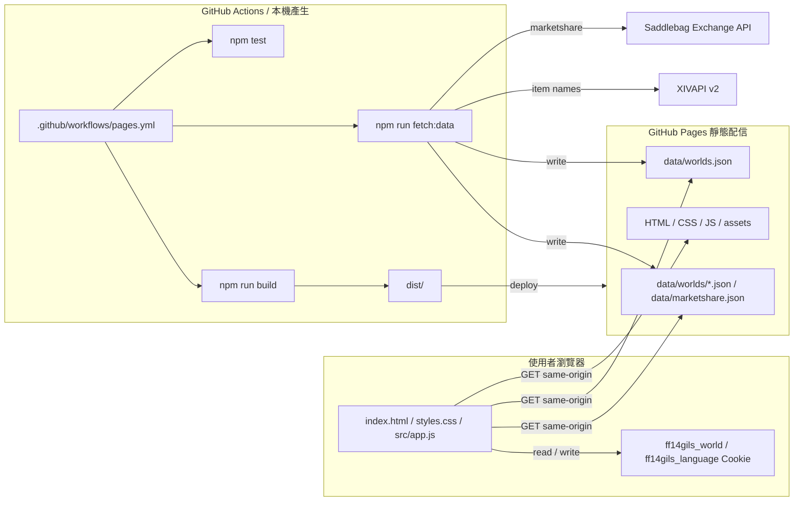

# FF14Gils 繁體中文版

FF14Gils 是用 GitHub Pages 部署的靜態市場看板，用來從 FINAL FANTASY XIV 國際服市場資料中找出比較容易販售的金策候選。這個 fork 聚焦繁體中文玩家常用的 Elemental DC，預設世界為 `Typhon`。

## 版本範圍

- UI 預設語言為繁體中文，並保留日本語、English 切換。
- GitHub Actions 預設產生 Elemental DC 的 `Aegis`、`Atomos`、`Carbuncle`、`Garuda`、`Gungnir`、`Kujata`、`Tonberry`、`Typhon` 市場快照。
- 初始顯示世界為 `Typhon`，銷售期間支援 1 天、3 天、7 天。
- 使用者瀏覽器只讀取 GitHub Pages 上的靜態檔與預先產生 JSON，不會直接呼叫外部市場 API。
- 道具名稱資料來源目前沒有官方繁中欄位，因此繁中 UI 預設以英文道具名為主，日文名作為輔助搜尋／顯示資料。

## 資料與權利

FF14Gils 是 FINAL FANTASY XIV 的非官方粉絲網站，與 SQUARE ENIX CO., LTD. 無關。FINAL FANTASY XIV 相關名稱、資料、圖片與其他權利均屬 SQUARE ENIX CO., LTD. 所有。

資料生成使用下列公開資料來源：

- Saddlebag Exchange API：取得 1 天、3 天、7 天市場統計候選資料。
- XIVAPI v2：僅用於取得道具名稱，不保存說明文字、圖示或詳細遊戲資料。

外部資料來源的規格與使用條件可能變更，正式公開前請確認各資料來源條款。上游 repo 未附明確開源授權檔，若要長期公開維護 derivative version，建議先向原作者確認授權。

## 架構



## 開發指令

```powershell
npm test
npm run fetch:data
npm run build
npm run serve
```

## 環境變數

`npm run fetch:data` 可用下列環境變數調整資料產生範圍：

- `FF14GILS_SERVER`：初始顯示世界，繁中版預設 `Typhon`。
- `FF14GILS_WORLDS`：要產生的世界清單，使用逗號分隔。未指定時會產生所有國際服世界。
- `FF14GILS_PERIODS`：要產生的銷售期間，可用 `1d`、`3d`、`7d`。
- `FF14GILS_PRESET`：`all`、`housing`、`materials`、`consumables`、`collectibles`、`custom`。
- `FF14GILS_CUSTOM_FILTERS`：`custom` 用的分類 ID。
- `FF14GILS_FETCH_RETRIES`：外部 API 暫時性 `429` / `5xx` 回應的重試次數。
- `FF14GILS_FETCH_RETRY_DELAY_MS`：外部 API 重試的初始等待時間。
- `FF14GILS_ITEM_NAME_LANGUAGE`：XIVAPI v2 道具名稱語言，支援 `ja`、`en`、`fr`、`de`。目前不支援 `zh-TW`。

## 部署

`.github/workflows/pages.yml` 會執行 `npm test`、`npm run fetch:data`、`npm run build`，並將 `dist/` 部署到 GitHub Pages。繁中版 workflow 已預設使用 Elemental DC 與 `Typhon` 初始世界。
